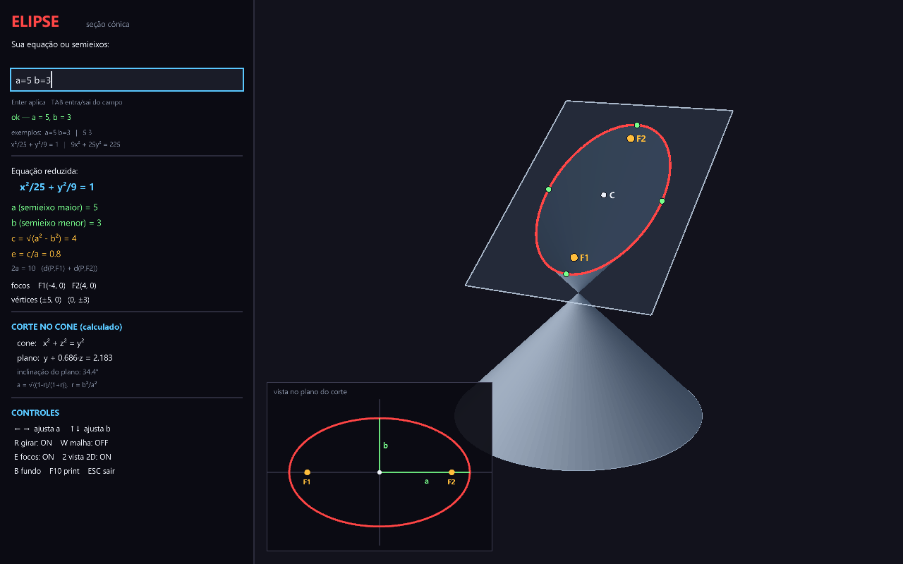

# Elipse — seção cônica em C# (Raylib-cs)

Você digita a **sua** equação (ou os semieixos) e o programa desenha o **cone
duplo**, o **plano de corte** que produz exatamente aquela elipse e a curva da
interseção, com **centro, focos e vértices** — mais uma vista 2D da elipse no
plano do corte, para conferir a conta.

Entrada inválida **não** desenha nada errado: mostra o erro no painel e mantém a
última elipse válida na tela.

Mesma pilha do projeto `Elipse`: C# .NET 8 + Raylib-cs 6.0.0.



## Como executar

```bash
dotnet run                                  # abre com a=5, b=3
dotnet run -- --claro                       # tema claro (fundo branco)
dotnet run -- --a=9 --b=2                   # já abre com esses semieixos
dotnet run -- --teste                       # autoteste do leitor de equações (console)
dotnet run -- --png --saida=elipse.png      # salva um quadro e sai
```

## O campo de entrada

Clique no campo (ou **TAB**), digite e aperte **Enter**. São aceitos quatro
formatos, todos equivalentes a `a = 5`, `b = 3`:

```
a=5 b=3
5 3
x²/25 + y²/9 = 1
9x² + 25y² = 225
```

Aceita `^2` no lugar de `²`, vírgula decimal (`a=2,5`), espaços em qualquer
lugar e maiúsculas. Quando `a = b` o programa avisa que é o caso particular da
**circunferência**.

### Erros tratados

| entrada | mensagem |
|---------|----------|
| `x²/25 - y²/9 = 1` | sinais opostos em x² e y²: essa equação é de uma **hipérbole** |
| `x²/25 = 1` | falta o termo em y²: com um só termo quadrático a curva é uma **parábola** |
| `x²/25 + y²/9 = 0` | lado direito igual a zero: isso não é uma elipse (é um ponto) |
| `x²/a² + y²/b² = 1` | troque a² e b² pelos valores numéricos |
| `x² + 4y + 9 = 1` | não aceito termos lineares (só a forma reduzida) |
| `a=0 b=3` | os semieixos precisam ser maiores que zero |
| `x²/100 + y²/0.5 = 1` | elipse muito alongada para o desenho (a/b ≤ 10) |
| `banana`, vazio | falta o "=" da equação / digite algo |

`dotnet run -- --teste` roda exatamente esses casos e imprime o resultado de
cada um.

## Controles

| Tecla | Ação |
|-------|------|
| **Enter** | aplica o que está no campo |
| **TAB** | entra/sai do campo de texto |
| **← →** | ajusta `a` ao vivo (fora do campo) |
| **↑ ↓** | ajusta `b` ao vivo (fora do campo) |
| **R** | liga/desliga a oscilação da câmera |
| **W** | malha (wireframe) |
| **E** | mostra centro, focos e vértices |
| **2** | vista 2D da elipse |
| **B** | tema claro / escuro |
| **F10** | salva `elipse.png` |
| **ESC** | sai do campo; fora dele, fecha |

## A matemática

Cone duplo com vértice na origem, eixo em **Y** e semi-ângulo de 45°:

```
x² + z² = y²
```

como união das geratrizes (retas que passam pelo vértice):

```
P(t, θ) = t · (cos θ , 1 , sen θ)
```

Plano de corte inclinado em torno do eixo X:

```
y + a·z = d          com  0 ≤ a < 1  e  d > 0
```

Substituindo `P(t, θ)` no plano sai a curva em forma fechada — um ponto por
ângulo θ:

```
t(θ) = d / (1 + a·sen θ)
```

Como `|a| < 1` o denominador nunca zera: a curva é **fechada** e fica toda em uma
folha do cone. É a elipse (`a = 0` → circunferência).

Substituindo `y = d - a·z` em `x² + z² = y²` e completando o quadrado:

```
centro          C = ( 0 , d/(1-a²) , -a·d/(1-a²) )
semieixo maior  A = d·√(1+a²) / (1-a²)      (na direção inclinada do plano)
semieixo menor  B = d / √(1-a²)             (na direção x)
excentricidade  e = |a|·√2 / √(1+a²) = c/A
```

### O caminho inverso (é o que a entrada usa)

Dados os seus `a` e `b`, o programa precisa **descobrir o plano**. Com
`r = B²/A²`:

```
B²/A² = (1-a²)/(1+a²)   ⟹   a = √( (1-r)/(1+r) )        d = B·√(1-a²)
```

Para `a=5, b=3`: `r = 0,36` → inclinação `0,686`, `d = 2,183`, ângulo do plano
`34,4°` — e de volta pela fórmula direta sai exatamente `A=5`, `B=3`, `c=4`,
`e=0,8`. É por isso que o painel mostra o plano como "calculado".

## Estrutura

```
Conicas/
├── Conicas.csproj    # net8.0 + Raylib-cs
├── Elipse.cs         # modelo: cone, plano, curva, centro/focos/vértices, inverso A,B -> a,d
├── Analise.cs        # leitor da entrada + todas as validações e mensagens de erro
├── CampoTexto.cs     # campo de texto (a Raylib não tem widgets)
├── Cena3D.cs         # malha do cone, plano translúcido, sombreamento, curva
├── Tema.cs           # paletas (escuro / claro)
├── Fonte.cs          # fonte TrueType do sistema (acentos, negrito, quebra de linha)
├── Program.cs        # loop, painel, vista 2D, autoteste
└── exemplos/         # imagens geradas com --png
```

### Como o corte é desenhado

A superfície é uma malha de quadriláteros em `(θ, t)`. Para cada θ o `t` vai de 0
(vértice) até o limite daquela geratriz; na folha superior o limite é o próprio
`t(θ)` do plano — então **a borda da malha é a elipse**, sem recorte artificial.
O cone e o retângulo do plano são redimensionados a cada nova entrada
(`Elipse.Enquadrar`), e a câmera se afasta conforme o tamanho da cena, então
funciona igual para uma elipse pequena ou grande.

Outros detalhes: sombreamento meio-Lambert com luz quase horizontal;
`Rlgl.DisableBackfaceCulling()` para a face interna aparecer na abertura do
corte; plano translúcido desenhado depois do cone (o z-buffer resolve a
oclusão); contorno do plano e curva vermelha projetados com `GetWorldToScreenEx`
e desenhados em 2D por cima, para ficarem finos em qualquer escala.
